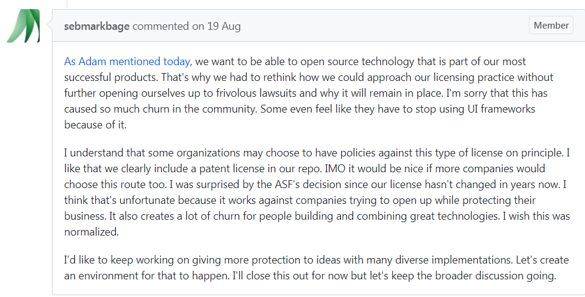
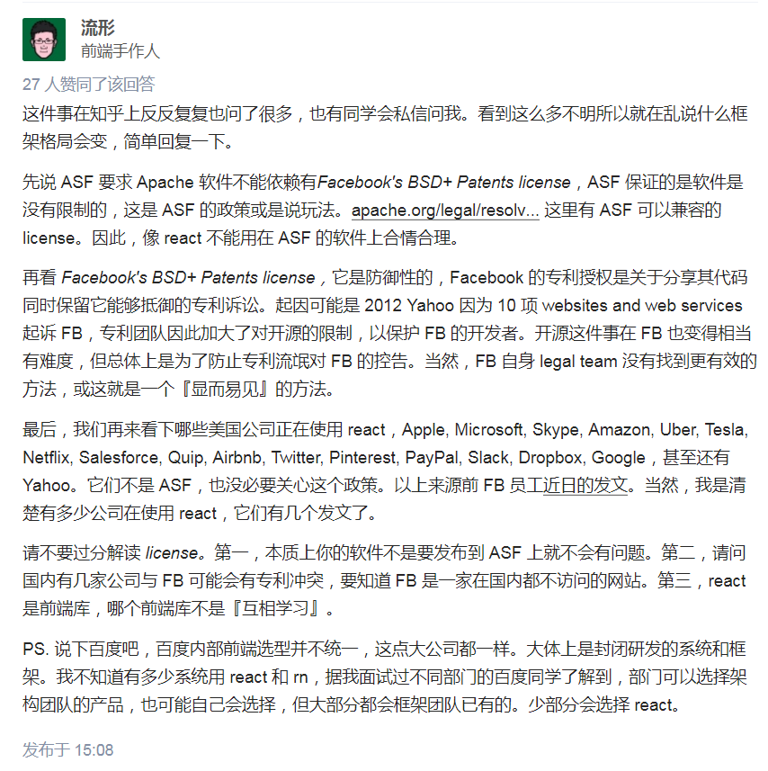

### 官方对react license的表述
1. [React License](https://github.com/facebook/react/blob/master/LICENSE)
2. [Explaining React's license](https://code.facebook.com/posts/112130496157735/explaining-react-s-license/)
3. [Open Source License FAQ](https://code.facebook.com/pages/850928938376556)

### Github上相关issues

1. [Consider re-licensing to AL v2.0, as RocksDB has just done](https://github.com/facebook/react/issues/10191)
2. [Update React license FAQ/update license itself ](https://github.com/facebook/react/issues/10719)

###  国外社区相关讨论
1. [The React license for founders and CTOs](https://medium.com/@ji/the-react-license-for-founders-and-ctos-b38d2538f3e5)
2. [On React and WordPress](https://ma.tt/2017/09/on-react-and-wordpress/)

### 国内相关讨论

1. [阿里还会使用react吗？](https://www.zhihu.com/question/65446071/answer/231113168)
2. [如何看待百度要求内部全面停止使用React / React Native?](https://www.zhihu.com/question/65437198/answer/231116042)
3. [法律角度你可以放心使用React吗？](https://zhuanlan.zhihu.com/p/27990414)
4. [React 路/粉/黑 都该了解的 React license 争议](https://juejin.im/entry/59a55d27f265da248808ae39)

### 国内外知名React开发者谈React license

1. [Sebastian Markbåge](https://github.com/sebmarkbage)
> facebook 科学家 tc39成员 react团队负责人

2. [Dan Abramov](https://github.com/gaearon)
> Working on @reactjs. Co-author of Redux and Create React App. Building tools for humans.

3. [流形](https://www.zhihu.com/people/arcthur)
> 现任阿里巴巴数据技术与产品部前端团队负责人，专注在React、数据可视化、Node等领域，《深入 React 技术栈》作者，知乎专栏《pure render》创办人

4. [程墨](https://www.zhihu.com/people/morgancheng)
> 《深入浅出React和Redux》作者

